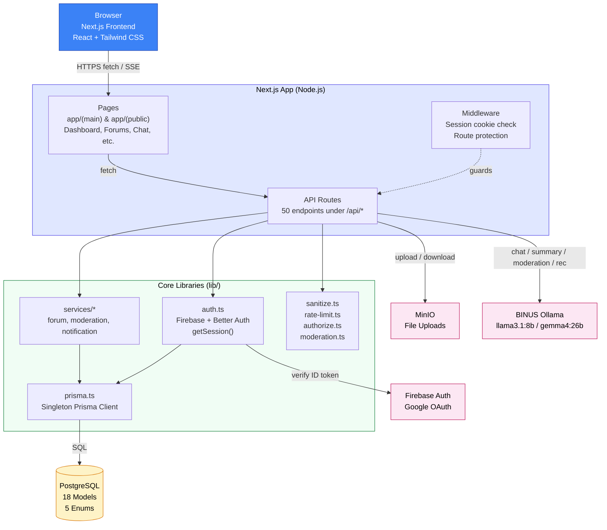
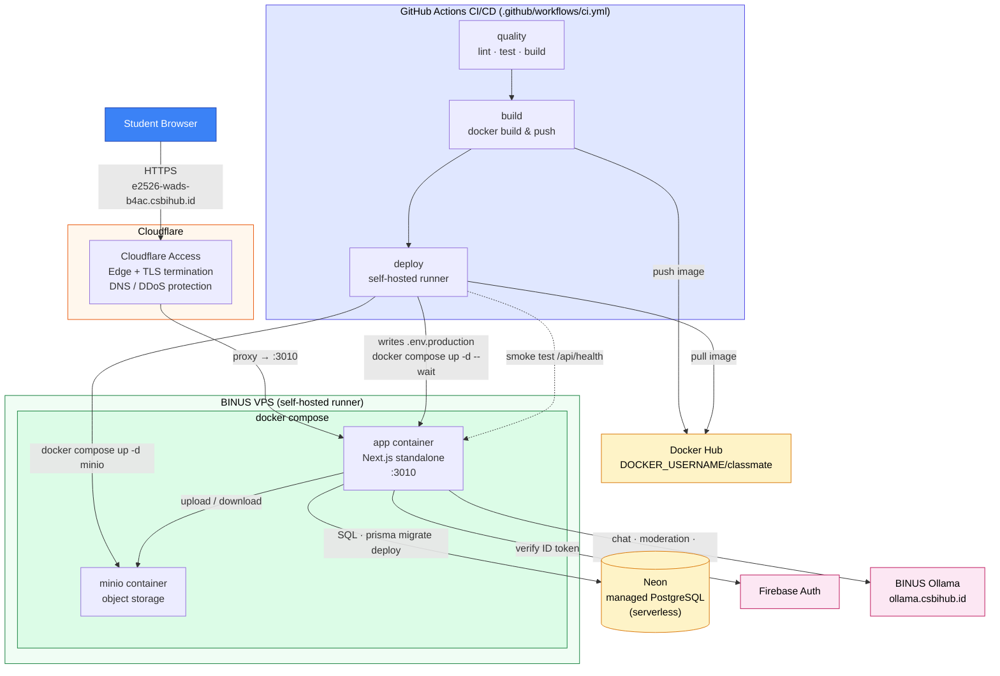

# 5. System Architecture

[← Back to README](../../README.md)

---

## 5.1 High-Level System Architecture

---

## 5.2 Architecture Explanation

### Frontend ↔ API ↔ Database Interaction

1. **Client → API:** The browser makes `fetch` calls to Next.js API routes (`/api/*`). Server-rendered pages call service functions directly without going through HTTP.
2. **API → Database:** All database access goes through `lib/prisma.ts` (singleton Prisma client). No database connection is ever exposed to the frontend.
3. **API → AI:** The AI Tutor route streams tokens from Ollama back to the client via Server-Sent Events. Moderation and summarization are synchronous Ollama calls inside API handlers. Recommendations are purely algorithmic — no AI call.
4. **File Uploads:** Study materials are stored in MinIO object storage, with magic-byte validation before acceptance.

### Separation of Concerns

| Layer              | Responsibility                                     | Modules                                       |
| :----------------- | :------------------------------------------------- | :-------------------------------------------- |
| Presentation       | UI rendering, user interaction                     | `app/(main)/`, `app/(public)/`, `components/` |
| HTTP/Routing       | Request handling, response shaping                 | `app/api/*` (50 route files)                  |
| Business Logic     | Domain rules for forums, moderation, notifications | `lib/services/*`                              |
| Authentication     | Session resolution                                 | `lib/auth.ts` (Firebase + Better Auth)        |
| Authorization      | Role enforcement                                   | `lib/authorize.ts`                            |
| Input Sanitization | XSS prevention, HTML stripping                     | `lib/sanitize.ts`                             |
| Rate Limiting      | Throttling, abuse prevention                       | `lib/rate-limit.ts` (5 tiers)                 |
| AI Moderation      | Content safety scoring, fail-closed                | `lib/moderation.ts`                           |
| Data Access        | SQL generation, type-safe queries                  | `lib/prisma.ts` + Prisma schema               |
| External Services  | OAuth, storage, AI                                 | Firebase Auth, MinIO, BINUS Ollama            |

### Where Security Is Enforced

- **Middleware (`middleware.ts`):** Checks for `session` (Firebase) or `better-auth.session_token` cookie on every protected route; rewrites to 404 if absent.
- **API layer:** Every protected endpoint calls `getSession()` and returns `401` if no valid session exists. Role-restricted endpoints call `requireModerator()` / `requireAdmin()`.
- **Input layer:** All user-supplied strings pass through `lib/sanitize.ts` (HTML stripping + entity encoding) before storage.
- **AI moderation:** Every `POST` to forum posts, replies, and chat messages passes through the Ollama moderation check; content is rejected if moderation returns a violation or if Ollama is unavailable (fail-closed).
- **Rate limiting (5 tiers):** `aiLimiter` 20/hr · `moderationLimiter` 60/min · `authLimiter` 10/15min · `writeLimiter` 30/min · `generalLimiter` 100/min.
- **CSRF:** Firebase session cookie uses `sameSite: 'strict'`, `httpOnly: true`; Better Auth has CSRF protection enabled by default.

---

## 5.3 Deployment / Infrastructure Architecture

The logical architecture above runs as a **containerized deployment** on a campus-provided BINUS VPS, fronted by Cloudflare Access and delivered by a GitHub Actions CI/CD pipeline. The application is never run as a bare Node process in production — it ships as a Docker image.

### Deployment Notes

- **Containerization:** The app is built as a multi-stage Docker image (`Dockerfile`, `node:22-bookworm-slim`, Next.js `standalone` output) and run via `docker compose` on the VPS. `NEXT_PUBLIC_*` vars are inlined at **build** time as Docker build args; server secrets are injected at **run** time from `.env.production`.
- **Compose profiles:** `docker-compose.yml` defines a `local` profile that adds **Postgres** and **MinIO** containers for development (`docker compose --profile local up`). In **production** only the `app` and `minio` services run — the database is **Neon** (serverless managed PostgreSQL) reached via `DATABASE_URL`; no Postgres container runs in prod.
- **CI/CD pipeline:** `push to main → quality → build → deploy`. The `deploy` job runs on a **self-hosted GitHub Actions runner** on the VPS: it writes `.env.production` from GitHub Secrets, pulls the new image, starts MinIO, replaces the app container (`--wait`), smoke-tests `http://127.0.0.1:3010/api/health`, then removes `.env.production` and prunes dangling images.
- **Migrations:** `npx prisma migrate deploy` runs automatically during deploy. Re-seeding is manual (see [deployment.md](./deployment.md)).
- **Edge:** Cloudflare Access terminates TLS and guards the public URL `https://e2526-wads-b4ac.csbihub.id`; the container itself listens on plain HTTP `:3010` behind the proxy.

> For step-by-step deploy commands, environment variables, and the full CI/CD breakdown, see [11. Deployment & Production Setup](./deployment.md).
